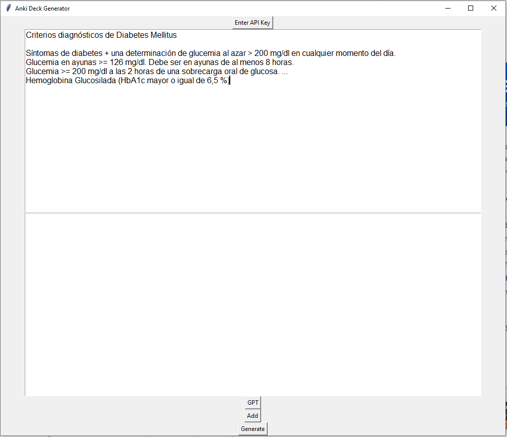
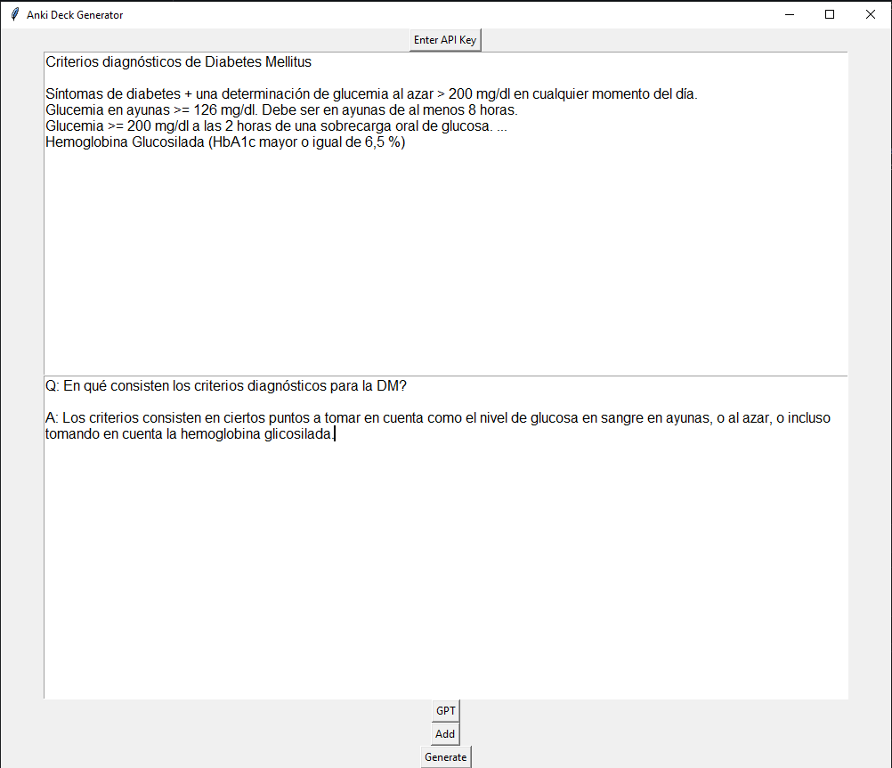

# GPT-anki-helper

## Getting Started

Curruently the desktop app works only on windows.

### Installing

You need to go to the "[realeases](https://github.com/GingerAle3101/GPT-anki-helper/releases)" page, then you click on the link called *GPT_Anki_Helper.zip*

Once you have downloaded it you can extract the .exe file or just open it directly inside the .zip file

Then you just, use the app!

### Usage

First you enter your OpenAi API key, you can find it inside your [OpenAi platform homepage](https://platform.openai.com/), you create your account and then look for "view API keys" inside your profile menu (right upper corner). Once you got your API key you have to set it with the "Enter API key" button shown below:

You choose a text, you copy it inside the first text box like above.
You click the "GPT" button and check the response->

If the response is good, then you click "add" to add it to your deck, and once you have    *all*    your pairs added, you click "generate" 

    DO NOT REMOVE THE Q: AND A: MARKERS 
    OTHERWISE THE PROGRAM WONT SAVE THE TEXT 
    NEXT TO THE MARKERS

## Authors

  - **Alejandro Quirós** - *Provided the simple code to build this*

See also the list of
[contributors](https://github.com/GingerAle3101/GPT-anki-helper/contributors)
who participated in this project.

